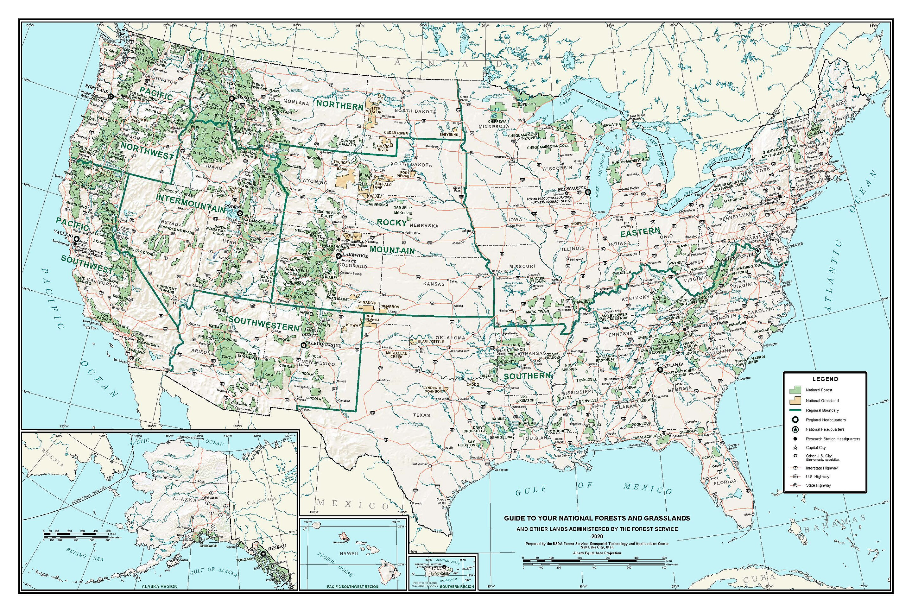
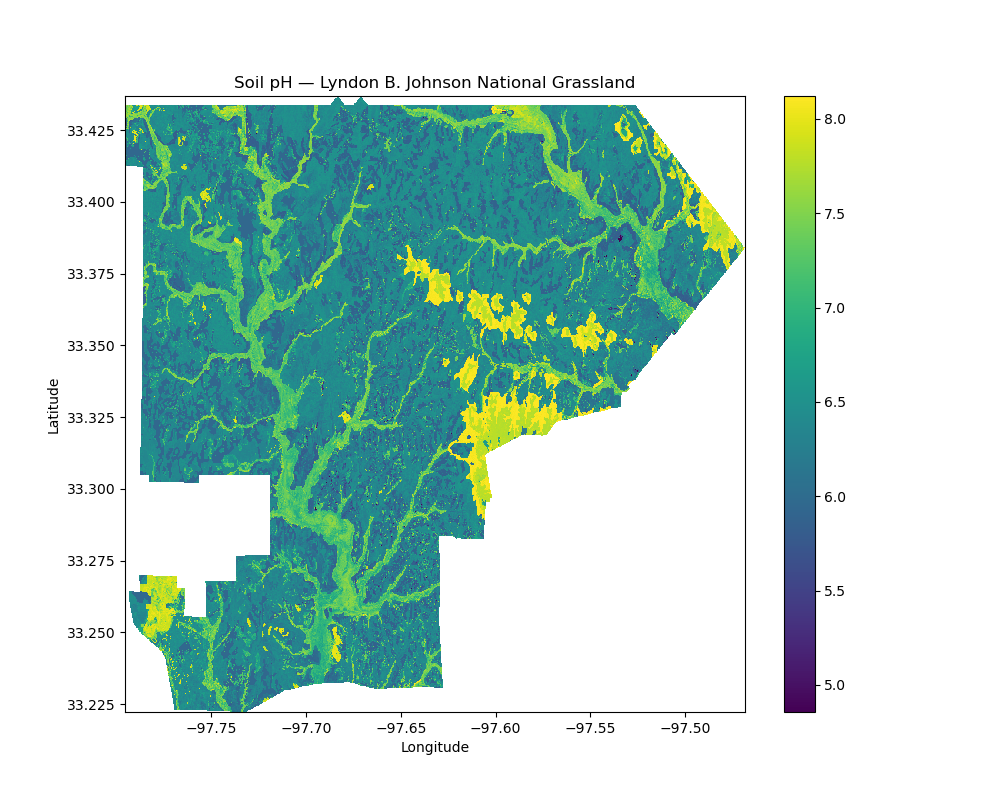
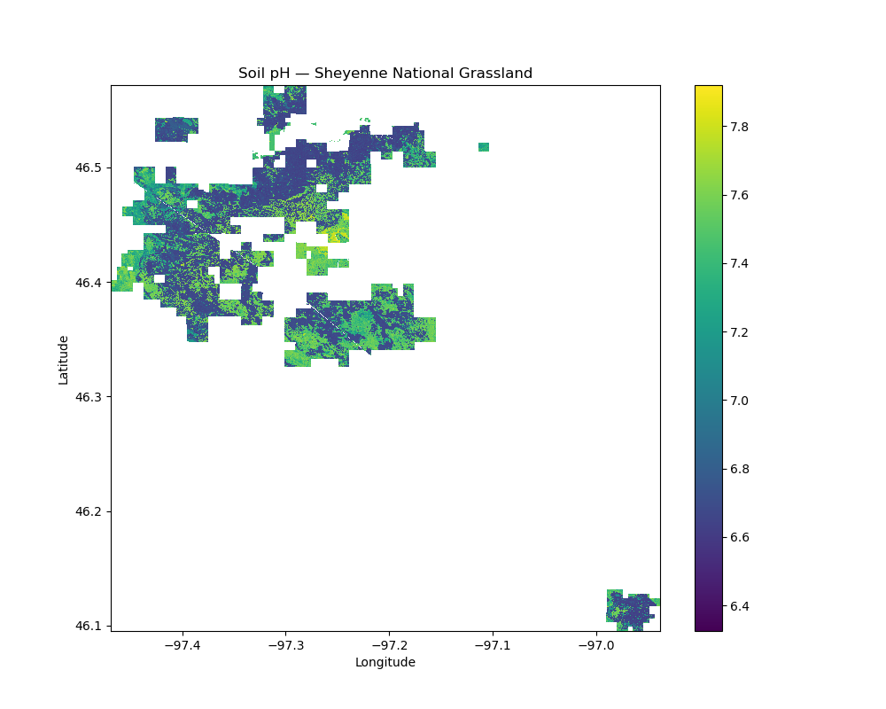
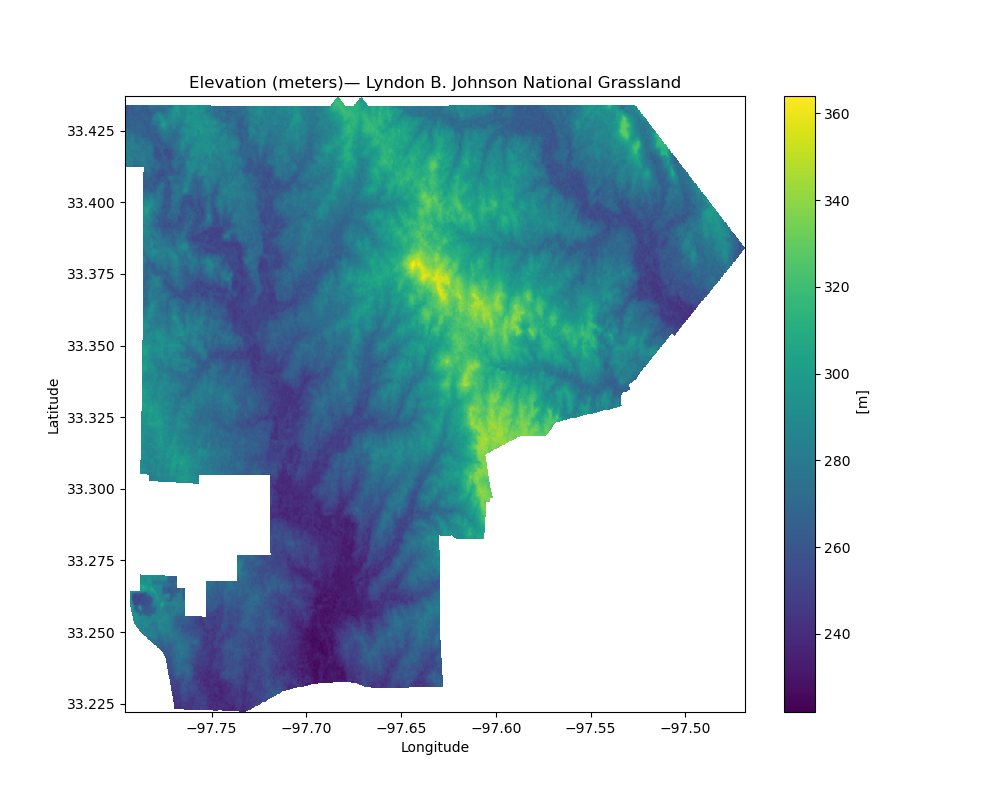
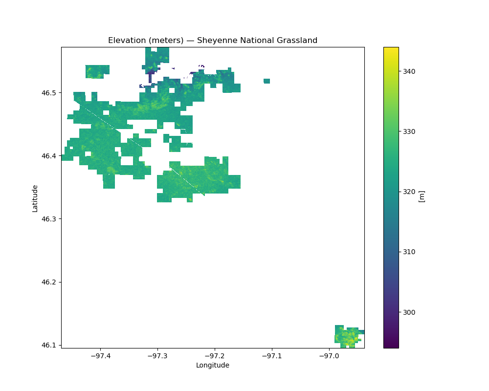
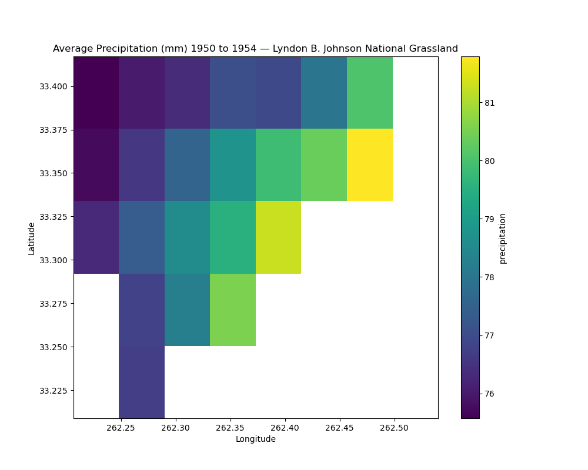
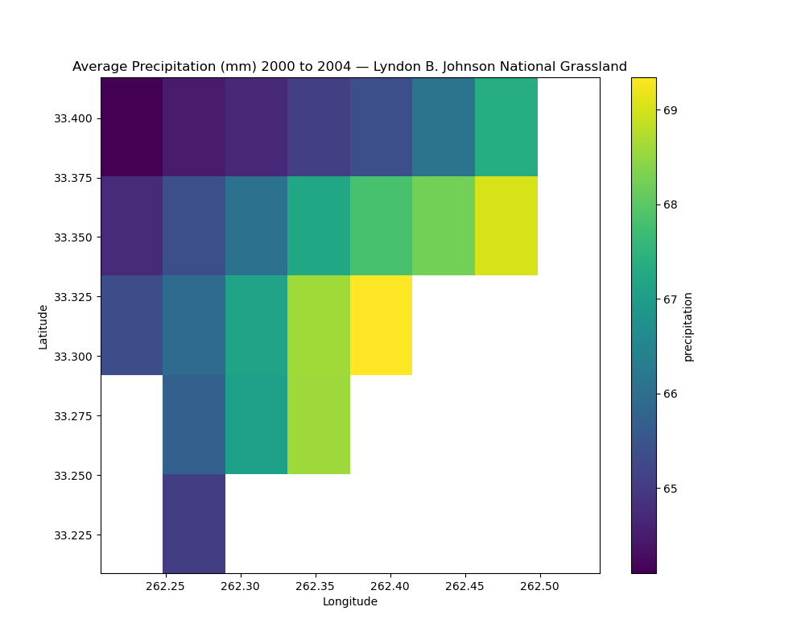
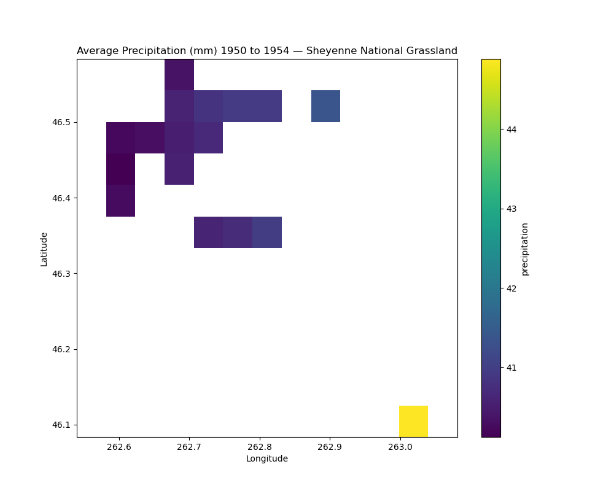
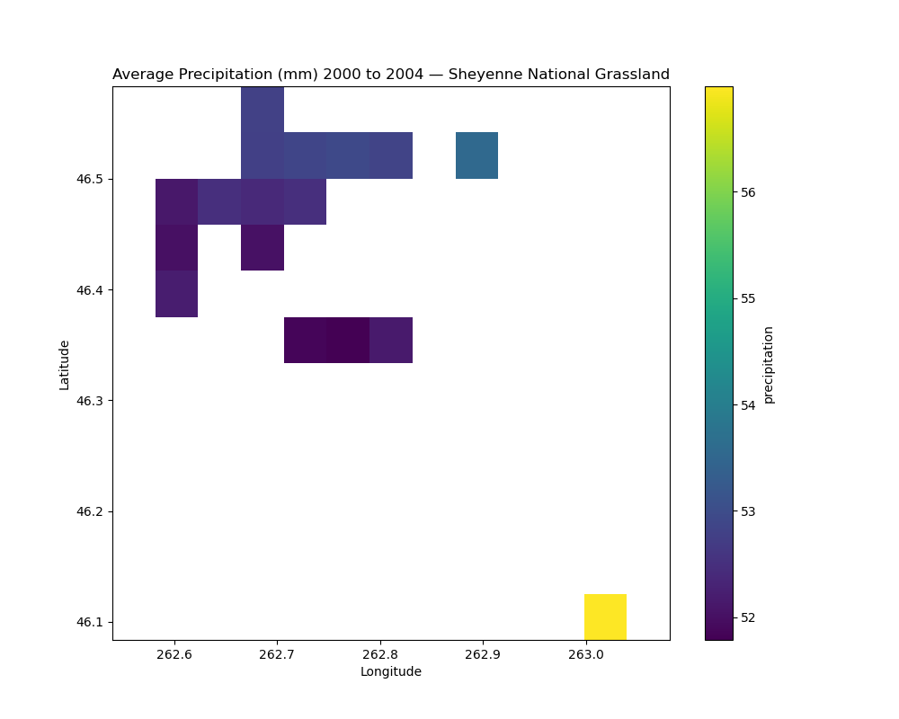

# Habitat Suitability 
## Project Description  
In this project, I developed a habitat suitability model for Sorghastrum nutans (commonly known as Indiangrass). Native to North America, S. nutans is found from the East Coast to Arizona, Utah, and the Rocky Mountains. Over the past 50 years, its range has been shifting northward. This project aims to investigate whether changes in key environmental variables—soil pH, slope, and precipitation—are making conditions less suitable for S. nutans in the South, while making them more favorable in the North, potentially driving the species' northward range expansion.

## Site Description
To explore this potential range shift, I compared two grasslands from the USFS National Grasslands. I selected one grassland from the Northern United States and one from the Southern United States to examine possible regional differences.

The Northern grassland chosen was the Sheyenne National Grassland in North Dakota. Sheyenne spans 70,446 acres and is located at 46 degrees North latitude. The Southern grassland selected was the Lyndon B. Johnson National Grassland in Texas. Lyndon B. Johnson covers 20,309 acres and is situated at 33 degrees North latitude.

## Data Sources
To determine habitat suitability, I used data on soil pH, elevation (to calculate slope), and historical precipitation.
### Soil pH
Soil pH is from from POLARIS, which is a complete map of soil series probabilities that has been produced for the contiguous United States. POLARIS uses geospatial enviornmental data and a machine learning algorihm (DSMART-HPC) to remap the Soil Survy Geographic (SSURGO) database. Data is available on the [POLARIS dataset website](http://hydrology.cee.duke.edu/POLARIS/)
I used mean soil pH in water values collected from 5 to 15 cm deep from the surface, with a resolution of 1 arcsec (~30 meters) 

#### Citation:
Chaney, N. W., Wood, E. F., McBratney, A. B., Hempel, J. W., Nauman, T. W., Brungard, C. W., & Odgers, N. P. (2016). POLARIS: A 30-meter probabilistic soil series map of the contiguous United States. Geoderma, 274, 54-67. https://doi.org/10.1016/j.geoderma.2016.03.025

### Elevation
Elevation data is from NASA Shuttle Radar Topography Mission (SRTM) provied by the Land Processes Distributed Active Archive Center (LP DAAC). SRTM is a collaboration between NASA, the National Geospatial-Intelligence Agency (NGA), and German and Italian space agencies. It is a near-global digital elevation model (DEM) using radar inferometry. Data was collected on the Space Shuttle Endeavour during its STS-99 mission from 02/11/2000 to 02/22/2000. This is version 3 of SRTM data and has a resolution of 1 arcsec. 

  
#### Citation:
NASA JPL (2013). <i>NASA Shuttle Radar Topography Mission Global 1 arc second</i> [Data set]. NASA EOSDIS Land Processes Distributed Active Archive Center. Accessed 2024-12-15 from https://doi.org/10.5067/MEaSUREs/SRTM/SRTMGL1.003
10

#### Precipitation 
Precipritation data is from Bejing Normal University's (BNU-ESM) "Monthly aggregation of downscaled daily meteorological data of Monthly Precipitation Amount" using the run r1i1p1 of the historical scenario. This dataset contains monthly downscaled meteorological and hydrological projections, including precipritation, temperature, and humidity, for the Conterminous United States at 1/24-deg resolution. These monthly values are obtained by aggregating the daily values obtained from the downscaling using the Multivariate Adaptive Constructed Analogs (MACA, Abatzoglou, 2012) statistical downscaling method with the METDATA (Abatzoglou,2013) training dataset.

  

#### Citation:
Abatzoglou, J. T., & Hegewisch, K. C. (2014). Monthly aggregation of downscaled daily meteorological data of Monthly Precipitation Amount from College of Global Change and Earth System Science, Beijing Normal University (BNU-ESM) using the run r1i1p1 of the historical scenario. Version 2.3, Dec 2013. REACCH. https://maca.northwestknowledge.net
(Original dataset available at: http://www.reacchpna.org/)

### Model
For my moddel I chose to train a fuzzy logic habitat suitability model. For S. nutans I researched what the optimal values are for each variable (soil pH, slope, and historic annual precipitation). S. nutans can survive with soil pH values between 4.8 and 8 (USDA NRCS 2017) and does best in pH ranges between 5 and 6 (Gardenia.net). I determined that S. nutans does better on shallow slopes and selected the optimal range to be 0 to 30 degrees. Finally, S. nutans exists in areas with annual preciptations of 11 inches to 45 inches (USDA NRCS 2017), but does best with rainfalls of between 20 and 30 inches annually (Gardenia.net).

For each digital number in each raster, a value from 0 to 1 was assigned for how close that grid square is to the optimum range (1=optimal, 0=incompatible). Each variable was assigned a max and min "dealbreaker"
where the grid square was determined to be fully incompatable and set to 0. If the pH was below 4.8 or above 8, the slope was above 90, or the precipitation was below 11 inches or above 45 inches annually the compatibility was mapped to 0. Additionally, each variable was assigned a max and min "optimal" value where the grid square was determined to be optimal and set to 1. Values between "min dealbreaker" and "min optimal" were linearly scaled from 0 to 1. Values between 'max optimal" and "max dealbreak" were linearly scaled from 1 to 0. Then the layers multiplying them together which gave a single suitability number for each square.

#### Citations:
Gardenia.net. (n.d.). Sorghastrum nutans. https://www.gardenia.net/plant/sorghastrum-nutans
U.S. Department of Agriculture, Natural Resources Conservation Service. (2017). The PLANTS database [Data set]. National Plant Data Team. http://plants.usda.gov

